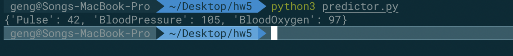
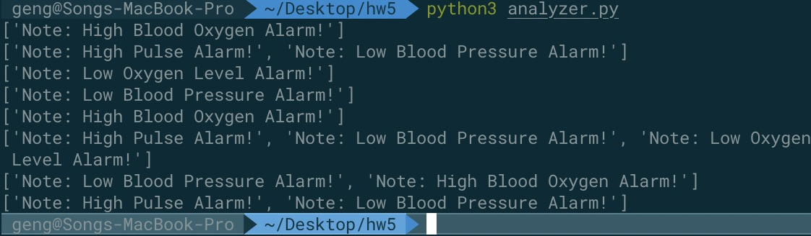
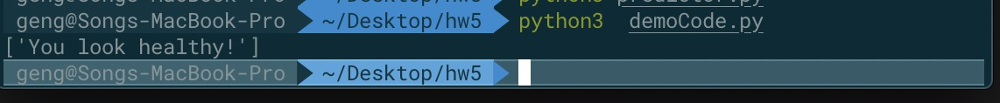

# health-monitor-4-heros
## AI API Part
The Artificial Intelligence API is to analize the output data, which should be stored in a csv file from our data computation API, then give label-classified result. According to the information of each clients, we can give medical suggestion to them. 

First we collect data of pluse, blood pressure and blood oxygen rate of each client for several time during a relative long period of time, then use the predict function to compute the average level of them. The arerage can minimize the test error in this task.

Then we pass the result through the analysis function in which we have set the threshold in advance, so we can get the AI prediction of the health condition of each client.

The wrap-up part of AI-prediction function result is shown below

