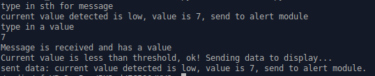
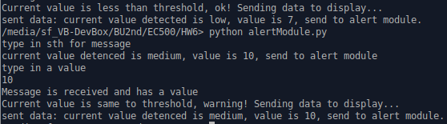
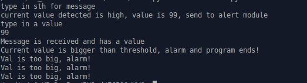

Alert Module     
All functions needed in this module.       

## Introduction   
There are 4 main functions in alertMod function.    

Inputs for alertMod functions are: 4 inputs for different kinds of health data and int value for threshold (default is 100).    
Based on the value and threshold, our alert program will determine to alarm and send data to display program.   

### value is less than threshold    
     

### value is same to threshold    
    

### value is bigger than threshold    
    

