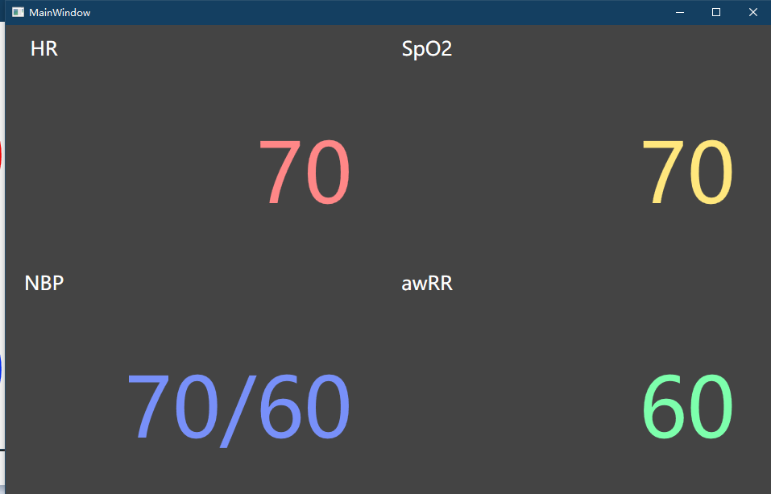

# Display Module
A Restful Api Display module for a health monitor 
## Build Instructions
### requirements
Visual Studio 2019

.net core 3.1
### steps
go to `Display` directory, double click `Display.sln`, and click the green triangle button on the top toolbar.
### OR download release
Check the release page on the Github
## demo
   
## technology
Display module based on .Net Core 3.1 & WPF(Windows Presentation Foundation) & ASP.Net Core

* (This means it's only compatible with Microsoft Windows)
## 4 health status
There are 4 health status, SpO2, Blood Presser, HR, PR need to display. They have different entry points.
### SpO2 Entry point
```url	
http://127.0.0.1:5000/spo2
```
### BP Entry point
```url	
https://127.0.0.1:5000/bp	
```
### HR Entry point	
```url
https://127.0.0.1:5000/hr
```
### PR Entry point	
```url
https://127.0.0.1:5000/awrr	
```
## Apis (use spo2 as a example)
## Apis
### write data to screen
```url
[post] https://127.0.0.1:5000/spo2
body :
	{"value" = "100"}
```
If command runs sucessful, module will return
```json
{
	"ok":"ok"
}
```

If command runs unsucessful, module will return
```json
{
	"error":"error"
}
```
### get screen status
```url
[Get] https://4heros.bu.edu/spo2
```
#### return
```json
{
	"name":"spo2",
	"status": "running",
	"timeStamp":"1584590938.5027065"
}
```
https://en.wikipedia.org/wiki/Unix_time
Click her for more information about the timeStamp
