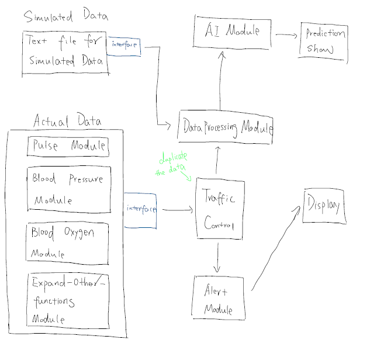

# health-monitor-4-heros
health-monitor-4-heros created by GitHub Classroom.     
Our group has 4 members.    
Current integrated modules look like below:     
   

## Alert Module section [Zhou Shen]    
#### Description      
There are 4 main functions in alertMod function.   
Right now, we let user to type in information as the input; in practical environment, we can receive information from machine.    
#### Inputs for alertMod functions    
information from machine collected and value.     
i.e. 
```
Input1: "{'Blood_Pressure': 10, 'Pulse': 75, 'Oxygen_Level': 340}"
Input2: "{'Blood_Pressure': 1000, 'Pulse': 95, 'Oxygen_Level': 300}"
Input3: "{'Blood_Pressure': 1, 'Pulse': 95, 'Oxygen_Level': 300}"
Input4: "{'Blood_Pressure': 5.6, 'Pulse': 95, 'Oxygen_Level': 300}"
```
#### Outputs for alertMod functions     
Based on the value and threshold, our alert program will determine to alarm or send data to display.     
In details, based on blodd pressure value, we set threshold to compare with, in this example is 10 (Ridiculous value, but just for demo).        
For sending data to display, it will call the url and post data.      
i.e.
```
Output1: "Current value is bigger than threshold, alarm and program ends!"
Output2: "Current value is same to threshold, warning! Sending data to display..."
Output3: "Current value is less than threshold, ok! Sending data to display..."
Output4: "Current value is less than threshold, ok! Sending data to display..."
```
#### Details   
Please click [here](https://github.com/BUEC500C1/health-monitor-4-heros/tree/master/AlertModule) to see more details in images.    

## Display section [Haoyang Wang]      
A Restful Api Display module for a health monitor.      
There are 4 health status, SpO2, Blood Presser, HR, PR need to display. They have different entry points.     
Value will return like below:    
```
{
	"name":"spo2",
	"status": "running",
	"timeStamp":"1584590938.5027065"
}
```
#### Details   
Please click [here](https://github.com/BUEC500C1/health-monitor-4-heros/tree/master/Display) to see more details in images.    

## Data section [Zeyu Song]       
#### input
write new data to DB
```
writetomysql.inserttoDB(input content)
```
#### output function
read all the content in DB
```
readfrommysql.read()
```
#### Details   
Please click [here](https://github.com/BUEC500C1/health-monitor-4-heros/tree/master/data) to see more details in images.    

## AI API section [Geng Song]    
The Artificial Intelligence API is to analize the output data, which should be stored in a json file from our data computation API, then give label-classified result. According to the information of each clients, we give medical suggestion to them.     
For this part, we decide to implement Google API. The try-catch exception should include methods corresponding to incompleted clients' data.     
#### Details   
Please click [here](https://github.com/BUEC500C1/health-monitor-4-heros/tree/master/AI%20API) to see more details in images.    

